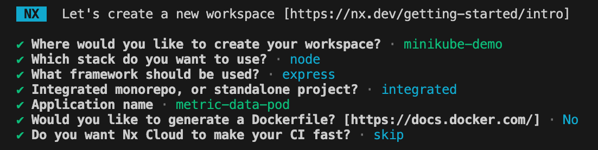
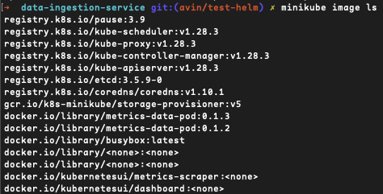

# DataIngestionService

<a alt="Nx logo" href="https://nx.dev" target="_blank" rel="noreferrer"></a>

✨ **This workspace has been generated by [Nx, Smart Monorepos · Fast CI.](https://nx.dev)** ✨

## Integrate with editors

Enhance your Nx experience by installing [Nx Console](https://nx.dev/nx-console) for your favorite editor. Nx Console
provides an interactive UI to view your projects, run tasks, generate code, and more! Available for VSCode, IntelliJ and
comes with a LSP for Vim users.

## Start the application

Run `npx nx serve study-data-pod` to start the development server. Happy coding!

## Build for production

Run `npx nx build study-data-pod` to build the application. The build artifacts are stored in the output directory (e.g. `dist/` or `build/`), ready to be deployed.

## Running tasks

To execute tasks with Nx use the following syntax:

```
npx nx <target> <project> <...options>
```

You can also run multiple targets:

```
npx nx run-many -t <target1> <target2>
```

..or add `-p` to filter specific projects

```
npx nx run-many -t <target1> <target2> -p <proj1> <proj2>
```

Targets can be defined in the `package.json` or `projects.json`. Learn more [in the docs](https://nx.dev/features/run-tasks).

## Set up CI!

Nx comes with local caching already built-in (check your `nx.json`). On CI you might want to go a step further.

- [Set up remote caching](https://nx.dev/features/share-your-cache)
- [Set up task distribution across multiple machines](https://nx.dev/nx-cloud/features/distribute-task-execution)
- [Learn more how to setup CI](https://nx.dev/recipes/ci)

## Explore the project graph

Run `npx nx graph` to show the graph of the workspace.
It will show tasks that you can run with Nx.

- [Learn more about Exploring the Project Graph](https://nx.dev/core-features/explore-graph)

## Steps used to create this repository

Initialise nx workspace:

```sh
npx create-nx-workspace --pm yarn
```

Options will be presented in the terminal.


In the new nx workspace, we want to create another app:

```sh
yarn add -D @nrwl/express

nx generate @nrwl/express:application study-data-pod
```

Select "Derived" option to create the second app in the `/apps` folder.

Create a Dockerfile for each service

Now we want to build both apps using nx, running the following command should populate a `dist/apps` folder with the two apps:

```sh
nx build metric-data-pod && nx build study-data-pod
```

If one of the apps fails to build, check its project.json file. If it is missing a `target.builds` property, copy this from the project.json file of the app that built successfully and modify the app name as required. Then retry the `nx build` command.

## Using Helm and Minikube locally

We want to build and push the Docker images to the Minikube docker repo.

If minikube is not already running:

```sh
minikube start
```

Connecting to minikube docker:

```sh
eval $(minikube -p minikube docker-env)
```

Now we build the docker image as usual:

```sh
docker build -f ./apps/metrics-data-pod/Dockerfile . -t metrics-data-pod:<version>
```

We should expect to see a list like below when running `minikube image ls` to check what images Minikube has access to locally.



Now we can attempt to deploy this image to a specified namespace (or omit the `--namespace` flag to deploy to Minikube's default namespace):

```sh
helm install <release_name> ./helm/<pod_to_deploy> --create-namespace --namespace <namespace>
```

Releasing a new version of the chart or image can be done using the following command:

```sh
helm upgrade <release_name> ./helm/<pod_to_deploy> --namespace <namespace>
```

Use the following kubectl command to port forward to interact with the service from outside the K8s cluster:

```sh
kubectl --namespace <namespace> port-forward <pod_name> <container_port>:<port>
```

## Connect with us!

- [Join the community](https://nx.dev/community)
- [Subscribe to the Nx Youtube Channel](https://www.youtube.com/@nxdevtools)
- [Follow us on Twitter](https://twitter.com/nxdevtools)
